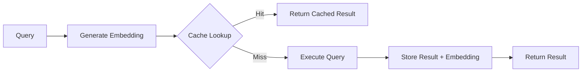

# Architecture

The pg_semantic_cache extension is implemented in pure C using the PostgreSQL
extension API (PGXS). This implementation approach provides several benefits
for performance and compatibility.

The extension provides the following benefits:

- The small binary size is approximately 100KB versus 2-5MB for Rust versions.
- Fast build times range from 10-30 seconds versus 2-5 minutes for Rust.
- Immediate compatibility works with new PostgreSQL versions immediately.
- Standard packaging is compatible with all PostgreSQL packaging tools.

## How It Works

The following diagram illustrates the semantic cache workflow:

The semantic cache operates through the following workflow:

1. The application generates an embedding by converting query text into a
   vector embedding using a preferred model (OpenAI, Cohere, etc.).
2. The extension checks the cache by searching for semantically similar
   cached queries using cosine similarity.
3. On a cache hit, if a similar query exists above the similarity threshold,
   the extension returns the cached result.
4. On a cache miss, the extension executes the actual query and caches the
   result with the embedding for future use.
5. Automatic maintenance evicts expired entries based on TTL and configured
   policies.

## Getting Help

The following resources are available for assistance:

- Browse the [documentation](https://docs.pgedge.com/) for detailed information.
- Report issues at [GitHub Issues](https://github.com/pgedge/pg_semantic_cache/issues).
- See [Use Cases](use_cases.md) for practical implementation examples.
- Check the [FAQ](FAQ.md) for answers to common questions.

