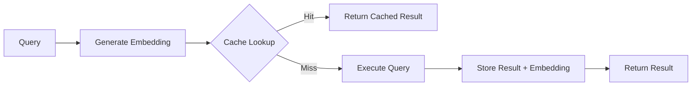

# Architecture

pg_semantic_cache is implemented in pure C using the PostgreSQL extension API
(PGXS), providing:

- Small binary size of ~100KB vs 2-5MB for Rust-based extensions.
- Fast build times of 10-30 seconds vs 2-5 minutes.
- Immediate compatibility works with new PostgreSQL versions immediately.
- Standard packaging is compatible with all PostgreSQL packaging tools.

## How It Works

1. Generate an embedding by converting your query text into a vector embedding
   using your preferred model (OpenAI, Cohere, etc.).
2. Check the cache by searching for semantically similar cached queries using
   cosine similarity.
3. On a cache hit, if a similar query exists above the similarity threshold,
   the cached result is returned.
4. On a cache miss, the actual query is executed and the result is cached with
   its embedding for future use.
5. Automatic maintenance evicts expired entries based on TTL and configured
   policies.

## Getting Help

- Browse the documentation.
- Report issues at
  [GitHub Issues](https://github.com/pgedge/pg_semantic_cache/issues).
- See [Use Cases](use_cases.md) for practical implementation examples.
- Check the [FAQ](FAQ.md) for answers to common questions.

